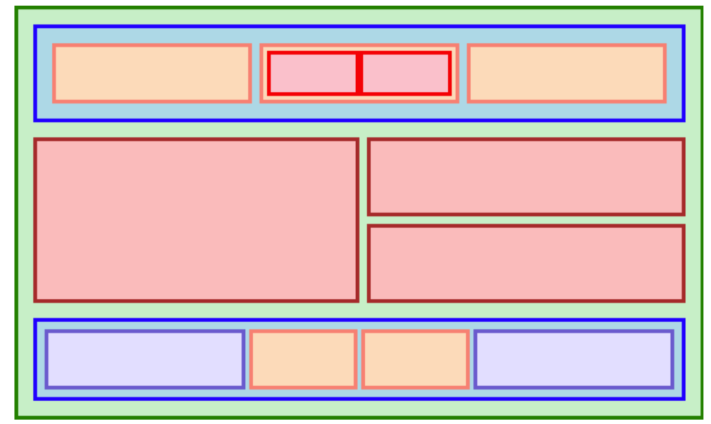

# top_flexbox

The Odin Project flexbox.
This will be a remake of the The Odin Project flexbox example in
the [Introduction to Flexbox](https://www.theodinproject.com/lessons/foundations-introduction-to-flexbox) lesson.

A simple project to practice using flexbox.

## Flexbox Result

Sample image of what the final render must look.

## Learned 

- Flexbox is an incredible tool. It easily arranges contents of the website
    * display: flex; turns an element into a flex box
    * flex-box - the flex container
    * flex-items - flex-box content
    * flex-grow - increase flex-items size relative to value and container
    * flex-shrink - reduce flex-items size relative to value and container
    
- Box Model
    * margin - the space outside the box model
    * border - the boundary between padding and margin
    * padding - the space between the content and border 

